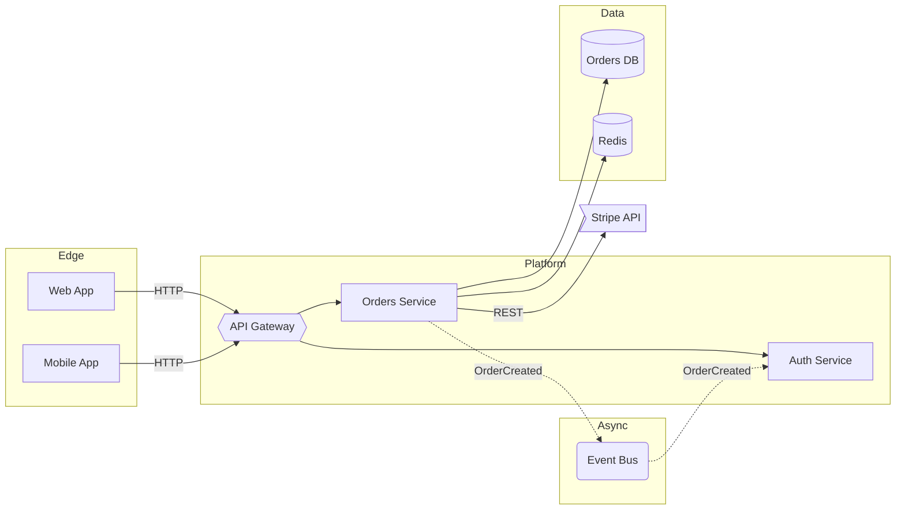

---
# GENERATED FROM core/skills/describe-architecture - do not edit by hand
name: tat-describe-architecture
description: "Use when: producing an as-is architecture diagram of a codebase, service or feature; writing or updating RFCs, design docs and onboarding material; explaining how components interact or locating the blast radius of a change. Describes existing architecture as a Mermaid diagram plus a short narrative grounded in the actual code. Does not design new architecture."
license: MIT
disable-model-invocation: true
metadata:
  adapter: claude
  generatedBy: tobias-agent-toolkit
---

# Describe Architecture

Read-direction skill: produces an architecture diagram and a concise narrative describing how an *existing* target system is structured and how data flows through it. Evidence comes from the code, config and infrastructure in the repository, never from assumptions. This skill documents what is — it does not propose new architecture or design changes.

## When to use this skill

- **Onboarding** — a new engineer needs the big picture on day one.
- **RFCs / design docs** — capture the current state before proposing changes.
- **Incident review** — share a common map to reason about blast radius.
- **Refactor planning** — visualize boundaries before cutting them.
- **Due diligence** — produce a defensible "as-is" view of a component.

## Scope first

Do not diagram "everything" by default. Before drawing, decide one of:

- whole repo
- one service or package
- one feature or user flow
- one cross-service interaction (e.g. login, checkout, event pipeline)

If the user did not specify a scope, ask for one or infer it from the currently open files and diff.

## Working approach

1. **Read top-down.** Manifests (`package.json`, `pyproject.toml`, `go.mod`, `Cargo.toml`, `pom.xml`), infra (`Dockerfile`, `docker-compose*.yml`, `k8s/`, `terraform/`, `serverless.yml`), CI, and entrypoints (`main.*`, `server.*`, `app.*`, `cmd/*`).
2. **Walk integration points.** HTTP/gRPC clients, message brokers, DB drivers, cache clients, SDK imports, env vars matching `*_URL`, `*_HOST`, `*_TOPIC`, `*_API_KEY`.
3. **Group by bounded context or deployment unit**, not by programming language or folder structure.
4. **Label every unverified edge as `(inferred)`** and list it in Open Questions. Do not silently guess.
5. **Stop early if ambiguous.** If the codebase is too large or undocumented to diagram faithfully, say so and propose a narrower scope before drawing.

## Output format

### 1. Executive summary (2-3 sentences)

What the system does, its architectural style (monolith, modular monolith, microservices, event-driven, serverless, hybrid), and the single most important boundary the reader should grasp first.

### 2. Architecture diagram

One Mermaid `flowchart LR` block (or `graph TD` when the flow is strongly vertical). Conventions:

- `subgraph` per deployment unit or bounded context.
- Solid `-->` for synchronous calls, dotted `-.->` for async / events / webhooks.
- Label edges with protocol or event name when it disambiguates: `-- HTTP -->`, `-. OrderCreated .->`.
- Shapes: `[Service]` for services, `[(Database)]` for datastores, `(Queue/Topic)` for brokers, `{{Gateway}}` for ingress/egress, `>External]` for third parties.
- Target ≤15 nodes. If you need more, split into a second "zoom-in" diagram with a clearly different scope.

Skeleton to adapt — do **not** ship this verbatim, replace every node with something found in the code:

### 3. Component notes

One bullet per node: responsibility, runtime/tech, and the folder or repo that owns it (when visible in the code).

### 4. Key flows

Trace 1-3 critical flows (e.g. "user login", "place order", "retry webhook") across the diagram in one or two sentences each. This is what turns a static picture into something a reader can reason with.

### 5. Open questions

Assumptions the diagram depends on and that could not be verified. Example: *"`Orders → Bus` is inferred from an SDK import in `orders/events.py`; no actual `publish()` call was found in the reviewed files."*

## Criteria

- **Fewer, clearer nodes** over exhaustive detail. A diagram that fits on one screen beats an exhaustive one.
- **Never invent components.** If it is not in the code, config or infrastructure, it does not go in the diagram.
- **Mark inferred edges explicitly** and echo them in Open Questions — readers should know what is verified vs guessed.
- **Prefer the user's vocabulary** (service names, domains) over generic labels like "Backend" or "DB".
